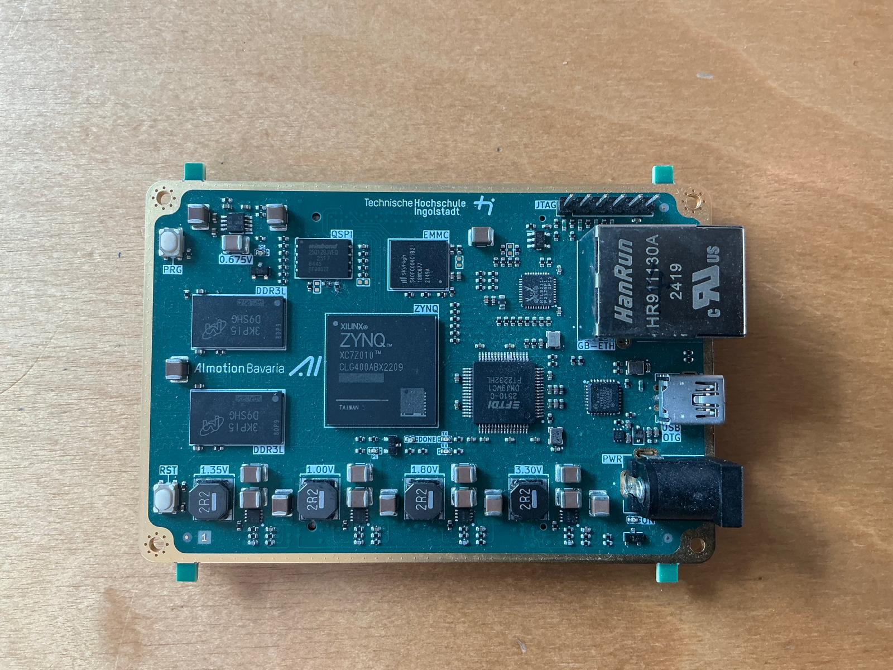
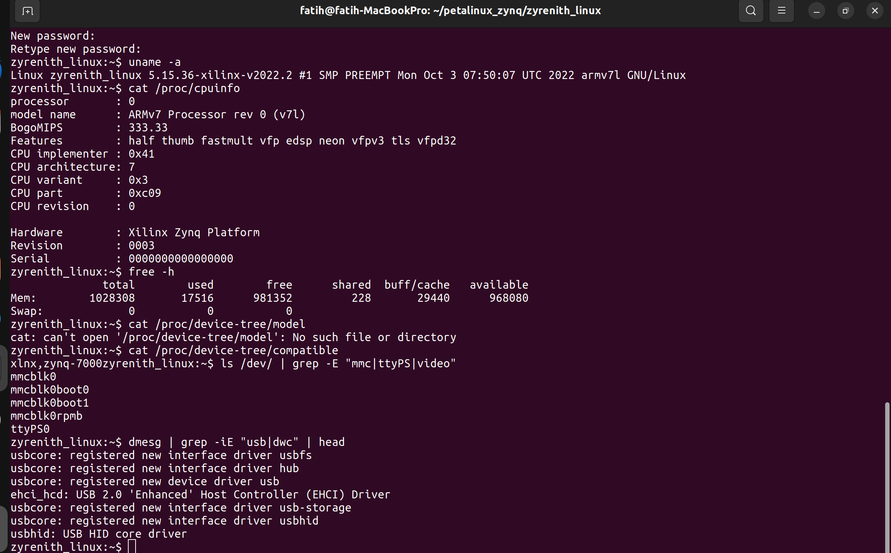

# Bachelorarbeit · Feature 1 – Zynq-Plattform & Embedded-Linux

**BACHELORARBEIT · FORTSCHRITTSBERICHT**

**Feature 1 — Zynq-Plattform & Embedded-Linux**

Hardware-Bring-up und PetaLinux-Inbetriebnahme des Custom-Boards „Zyrenith Explorer"



*Abb. 1: Custom-Board „Zyrenith Explorer" mit Zynq-7000 (XC7Z010)*

**SoC:** AMD/Xilinx Zynq-7000 XC7Z010-CLG400-1
**Toolchain:** Vivado / Vitis 2022.2 · PetaLinux 2022.2

---

## 1 Einleitung und Zielsetzung

Gegenstand dieser Bachelorarbeit ist die Inbetriebnahme eines kundenspezifischen Embedded-Boards auf Basis des AMD/Xilinx Zynq-7000-SoC. Das erste Arbeitspaket (Feature 1) hat zum Ziel, das Board von der reinen Hardware bis zu einem lauffähigen Embedded-Linux mit interaktiver Shell in Betrieb zu nehmen – also einen vollständigen **Bring-up** durchzuführen.

Der Arbeitsablauf gliedert sich in drei aufeinander aufbauende Stufen:

1. **Hardware-Beschreibung** – Konfiguration des Processing Systems in Vivado und Export als Hardware-Handoff-Datei (.xsa).
2. **Bare-Metal-Verifikation** – Nachweis der grundlegenden Hardware-Funktion (Takt, DDR, MIO, UART) mittels einer Testapplikation in Vitis.
3. **Embedded-Linux** – Aufbau, Build und Boot eines mit PetaLinux erzeugten Linux-Images.

Feature 1 bildet damit das Fundament für die weiteren Arbeitspakete *(USB-2.0-Kamera-Pipeline und Applikationsentwicklung)*, da diese ein funktionsfähiges Linux auf der Zielhardware voraussetzen.

## 2 Hardware-Plattform

Das Board basiert auf einem Zynq-7000-SoC, der ein Processing System (PS) mit Dual-Core ARM Cortex-A9 und ein FPGA-Fabric (Programmable Logic, PL) auf einem Chip vereint. Für das Bring-up sind folgende Komponenten relevant:

| Komponente | Ausprägung auf dem Board | Anbindung |
|---|---|---|
| SoC | XC7Z010-CLG400-1, Dual-Core Cortex-A9 | – |
| DDR-Speicher | 1 GB DDR3L (2 × Micron MT41K256M16) | DDR-Controller, 32 Bit |
| Boot-Flash | 16 MB QSPI (Winbond W25Q128) | QSPI (MIO 1–6) |
| Massenspeicher | eMMC | SD1-Controller (MIO 10–15) |
| Ethernet | Gigabit-PHY RTL8211F | GEM0 / RGMII (MIO 16–27) |
| USB | USB-2.0-HS-OTG, PHY USB3320 (ULPI) | USB0 (MIO 28–39) |
| Debug/Konsole | FTDI FT2232HL | JTAG + UART über USB |

Das FTDI-Bauteil ist für die Entwicklung zentral: Es stellt über ein einziges USB-Kabel gleichzeitig die **JTAG-Schnittstelle** (zum Laden von Programmen) und die **UART-Konsole** (für Boot-Ausgaben und Login) bereit.

## 3 Hardware-Beschreibung in Vivado

Die Hardware-Beschreibung wurde in Vivado 2022.2 **vollständig neu aufgebaut**. Das Ergebnis dieses Kapitels ist die Datei .xsa (Xilinx Shell Archive) – eine Handoff-Datei, die die komplette PS-Konfiguration (Peripherie, Takte, DDR-Einstellungen, Pin-Multiplexing) enthält und in den folgenden Stufen von Vitis bzw. PetaLinux weiterverwendet wird.

### 3.1 Projekt und Block-Design

Zunächst wurde ein RTL-Projekt für den exakten Baustein xc7z010clg400-1 angelegt. Anschließend wurde im IP-Integrator ein Block-Design erstellt und das **ZYNQ7 Processing System** hinzugefügt. Über die Funktion Run Block Automation wurden die externen Schnittstellen des PS (DDR und FIXED_IO) automatisch nach außen geführt. Da die Applikation ausschließlich das Processing System nutzt, bleibt das FPGA-Fabric leer.

### 3.2 Peripherie- und MIO-Konfiguration

Über die Seite MIO Configuration wurde jede Peripherie einzeln aktiviert und den korrekten MIO-Pins zugeordnet. Diese Zuordnung ist kritisch: Die Pins sind auf der Leiterplatte fest verdrahtet – eine falsche MIO-Wahl hätte zur Folge, dass das Signal am falschen physischen Pin ausgegeben würde und die Peripherie nicht funktioniert. Die Zuordnung erfolgte entsprechend dem Board-Schaltplan:

| Peripherie | MIO-Pins | IO-Standard / Bank |
|---|---|---|
| Quad-SPI Flash (Single-SS) | MIO 1–6 | LVCMOS 3.3 V (Bank 0) |
| UART 1 | MIO 8–9 | LVCMOS 3.3 V (Bank 0) |
| SD 1 (eMMC) | MIO 10–15 | LVCMOS 3.3 V (Bank 0) |
| ENET 0 | MIO 16–27 | HSTL 1.8 V (Bank 1) |
| ENET 0 – MDIO | MIO 52–53 | HSTL 1.8 V (Bank 1) |
| USB 0 | MIO 28–39 | HSTL 1.8 V (Bank 1) |

Entsprechend wurden die I/O-Bank-Spannungen gesetzt: **Bank 0 = LVCMOS 3.3 V** und **Bank 1 = HSTL 1.8 V**. Die Bank-1-Einstellung ist notwendig, da die schnellen Ethernet-Signale (RGMII) auf dem Board mit dem HSTL-1.8-V-Pegel betrieben werden. Alle nicht benötigten Schnittstellen (NAND, weitere UART/SPI/I2C/CAN usw.) wurden deaktiviert.

### 3.3 Taktkonfiguration

Auf der Seite Clock Configuration wurde die Eingangsfrequenz auf den Board-Oszillator von **33,333 MHz** gesetzt. Daraus leitet Vivado die abhängigen Takte ab: CPU (APU) **666,7 MHz** und DDR **533,3 MHz**. Zusätzlich wurde der Takteingang des GP-Master-Ports mit dem Fabric-Takt verbunden (FCLK_CLK0 → M_AXI_GP0_ACLK), da dieser sonst ohne gültige Taktquelle bleibt und die Validierung fehlschlägt.

### 3.4 DDR3L-Speicherkonfiguration (Custom)

Der verbaute DDR3L-Baustein ist nicht in der Vivado-Bauteilliste enthalten. Die Identifikation erfolgte über den FBGA-Code des Chips (D9SHG) als **Micron MT41K256M16** (4 Gbit, Organisation 256M × 16, DDR3L). Der Speicher wurde daher als **Custom**-Part konfiguriert. Die Parameter stammen aus drei unterschiedlichen Quellen:

- **Aus dem Datenblatt des Bausteins:** Speichertyp (DDR3L), Kapazität (4096 Mbit), Datenbreite (×16), Adressierung (Bank 3 / Row 15 / Col 10) sowie die Timing-Parameter des 1600-Speed-Bins.
- **Aus der Board-Topologie:** Effektive Busbreite 32 Bit (zwei ×16-Bausteine parallel), ECC deaktiviert (kein ECC-Baustein vorhanden).
- **Aus dem PCB-Layout:** Die board-spezifischen Signallaufzeiten (DQS-to-Clock-Delay und Board-Delay je Byte-Lane), abgeleitet aus den Leiterbahnlängen. Diese Werte sind einzigartig für dieses Board und sichern die Signalintegrität des Speicherinterfaces.

Die wichtigsten übernommenen Timing-Parameter sind nachfolgend zusammengefasst:

| Parameter | Wert | Parameter | Wert |
|---|---|---|---|
| Speichertyp | DDR3 (LV) | CAS Latency (CL) | 11 |
| Kapazität / Breite | 4 Gbit / ×16 | CAS Write Lat. (CWL) | 8 |
| Bus / Bausteine | 32 Bit / 2 | tRCD / tRP | 11 / 11 |
| Bank / Row / Col | 3 / 15 / 10 | tRC | 48,75 ns |
| Speed Bin | DDR3-1600K | tRAS / tFAW | 35 / 40 ns |

### 3.5 Validierung, Wrapper und Export

Nach Abschluss der Konfiguration wurde das Block-Design validiert (Validate Design), die Ausgabeprodukte generiert (Generate Output Products) und ein HDL-Wrapper erzeugt. Abschließend wurde die Hardware über File → Export Hardware (Pre-synthesis) als .xsa exportiert. Ein Bitstream ist nicht erforderlich, da das FPGA-Fabric leer ist; die für Bare-Metal und Linux benötigte PS-Initialisierung (ps7_init) ist Teil der .xsa.

### 3.6 Verifikation gegen die Referenz

Zur Qualitätssicherung wurde die selbst erzeugte .xsa parameterweise gegen eine bereitgestellte Referenz verglichen. Grundlage war ein Vergleich der PCW-Parameter in der Hardware-Handoff-Beschreibung (.hwh). Der erste Vergleich ergab drei Abweichungen, die anschließend korrigiert wurden:

| Parameter | Abweichung | Korrektur |
|---|---|---|
| Bank-1-Spannung | LVCMOS 1.8 V statt HSTL 1.8 V | auf HSTL 1.8 V gesetzt (inkl. aller Pin-IO-Standards der Bank) |
| GPIO (MIO) | deaktiviert | aktiviert (entspricht Referenz) |
| QSPI-Takt | 200 MHz statt 133 MHz | auf 133 MHz korrigiert |

Nach diesen Korrekturen stimmten **alle relevanten Parameter (DDR, Takte, Peripherie, MIO, IO-Standards)** vollständig mit der Referenz überein. Die eigene Hardware-Beschreibung ist damit verifiziert.

## 4 Bare-Metal-Verifikation (Vitis)

Vor dem Linux-Bring-up wurde die grundlegende Hardware-Funktion auf Bare-Metal-Ebene nachgewiesen. Aus der .xsa wurde in Vitis 2022.2 eine Plattform erzeugt. Diese enthält den **First Stage Boot Loader (FSBL)** – der über ps7_init Takte, DDR und MIO initialisiert – sowie das **Board Support Package (BSP)** mit den gerätespezifischen Treibern.

Auf dieser Plattform wurde eine „Hello World"-Applikation erstellt und über JTAG auf das Board geladen und ausgeführt. Die erfolgreiche Textausgabe über UART bestätigt das korrekte Zusammenspiel von **Spannungsversorgung, Takterzeugung, DDR-Speicher, MIO-Multiplexing und serieller Schnittstelle** – die notwendige Basis für alle weiteren Schritte.

## 5 Embedded-Linux mit PetaLinux 2022.2

PetaLinux ist ein auf dem Yocto-Projekt aufbauendes Werkzeug von AMD/Xilinx. Es übernimmt die verifizierte .xsa und leitet daraus automatisch die Zynq-spezifischen Bestandteile ab (Device-Tree, U-Boot- und Kernel-Konfiguration). Der Ablauf gliedert sich in drei Schritte:

### 5.1 Projekt anlegen und Hardware importieren

```bash
petalinux-create --type project --template zynq --name zyrenith_linux
petalinux-config --get-hw-description <pfad>/system_wrapper.xsa
```

*Erzeugung des Projekts (Vorlage Zynq-7000) und Import der Hardware-Beschreibung.*

Beim Import liest PetaLinux die .xsa ein und generiert automatisch die passende System-Konfiguration für die vorhandene Peripherie, den DDR-Speicher und die Taktung.

### 5.2 Build

```bash
petalinux-build
```

*Erzeugung aller Boot-Artefakte.*

Das Build erzeugt die vollständige Boot-Kette:

- `zynq_fsbl.elf` – First Stage Boot Loader (PS-Initialisierung)
- `u-boot.elf` – Second Stage Boot Loader
- `uImage` – Linux-Kernel
- `system.dtb` – Device-Tree (Hardware-Beschreibung für den Kernel)
- `rootfs.cpio.gz.u-boot` – Root-Filesystem

### 5.3 Boot über JTAG

In dieser Phase erfolgt das Booten über JTAG. Dabei werden FSBL, U-Boot, Kernel, Device-Tree und Root-Filesystem direkt in den DDR-Speicher geladen und ausgeführt, ohne den Flash-Speicher zu beschreiben:

```bash
petalinux-boot --jtag --kernel
```

*JTAG-Boot: Kernel und Root-Filesystem werden in den DDR geladen und gestartet.*

Der Vorteil dieses Verfahrens liegt im schnellen, iterativen Testen: Änderungen am Image können sofort getestet werden, ohne den Massenspeicher neu zu beschreiben. *Das persistente Ablegen im QSPI/eMMC ist Gegenstand einer späteren Stufe.*

## 6 Ergebnis

Das System bootet erfolgreich über die vollständige Boot-Kette (FSBL → U-Boot → Kernel) bis zur Login-Shell. Bereits die U-Boot-Ausgabe bestätigt die korrekte Hardware-Erkennung (u. a. **„DRAM: 1 GiB"**) – ein direkter Nachweis der korrekten DDR3L-Konfiguration aus Kapitel 3.4. Nach dem Login wurden folgende Punkte auf dem laufenden System verifiziert:

| Prüfpunkt | Ergebnis (auf dem Board verifiziert) |
|---|---|
| Kernel / Plattform | Linux 5.15.36-xilinx-v2022.2, „Xilinx Zynq Platform" |
| Prozessor | ARMv7 Cortex-A9 (CPU part 0xc09), mit NEON / VFPv3 |
| Arbeitsspeicher | 1 GB DDR3L vollständig erkannt (1.028.308 kB) |
| Massenspeicher | eMMC verfügbar (/dev/mmcblk0) |
| Serielle Konsole | UART aktiv (/dev/ttyPS0) |
| USB-Subsystem | USB-2.0-Host-Controller (EHCI) initialisiert |

*Auszüge der Verifikation direkt auf dem Zielsystem:*

```
zyrenith_linux:~$ uname -a
Linux zyrenith_linux 5.15.36-xilinx-v2022.2 #1 SMP PREEMPT armv7l GNU/Linux

zyrenith_linux:~$ free -h
Mem: total 1028308 used 17516 free 981352

zyrenith_linux:~$ cat /proc/device-tree/compatible
xlnx,zynq-7000

zyrenith_linux:~$ ls /dev/ | grep -E 'mmc|ttyPS'
mmcblk0 mmcblk0boot0 mmcblk0boot1 ttyPS0

zyrenith_linux:~$ dmesg | grep -iE 'usb|ehci'
ehci_hcd: USB 2.0 'Enhanced' Host Controller (EHCI) Driver
```



*Abb. 2: Verifikation auf dem Zielsystem – Kernel, Prozessor, 1 GB DDR und USB-Host-Controller*

## 7 Ausgewählte technische Herausforderungen

Beim Bring-up traten einige technisch aufschlussreiche Punkte auf, die kurz dokumentiert werden:

- **Custom-DDR statt Standard-Part:** Da der DDR-Baustein nicht in der Werkzeugliste enthalten ist, mussten Timing-Parameter aus dem Datenblatt und Signallaufzeiten aus dem Layout manuell eingetragen werden – eine fehlerhafte DDR-Konfiguration führt zu instabilem oder ausbleibendem Betrieb.
- **Kaskadierung der Bank-Spannung:** Das Ändern der Bank-Spannung wirkt sich nicht automatisch auf die IO-Standards der einzelnen MIO-Pins aus. Diese mussten explizit auf HSTL 1.8 V gesetzt werden, damit die eigene Beschreibung exakt der Referenz entspricht.
- **GP-Master-Takt:** Der Takteingang M_AXI_GP0_ACLK muss mit FCLK_CLK0 verbunden werden, da die Design-Validierung sonst mit einem Fehler abbricht.

## 8 Fazit und Ausblick

Feature 1 ist abgeschlossen. Die kundenspezifische Zynq-7000-Plattform wurde vollständig und von Grund auf in Betrieb genommen: von der selbst erstellten und gegen die Referenz verifizierten Hardware-Beschreibung über die Bare-Metal-Verifikation bis hin zu einem lauffähigen, über JTAG bootenden Embedded-Linux mit interaktiver Shell.

Da das USB-2.0-Host-Subsystem bereits erfolgreich initialisiert wird, ist die technische Grundlage für das nächste Arbeitspaket geschaffen: **Feature 2 – die Anbindung des USB-UVC-Kameramoduls (OV9281) sowie der Aufbau der V4L2-Video-Pipeline.**

---

*(Bu bölüm, `Feature1_Report_Detail.docx` dosyasından — kullanıcının kendi yazdığı orijinal Almanca rapordan — birebir aktarılmıştır. İçerik ve dil değiştirilmemiştir.)*
